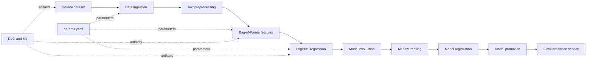

<div align="center">

# Emotion Detection MLOps

**A reproducible and deployable NLP pipeline for binary emotion classification.**

[](https://www.python.org/)
[](https://dvc.org/)
[](https://scikit-learn.org/)
[](https://mlflow.org/)
[](https://github.com/features/actions)
[](https://flask.palletsprojects.com/)
[](LICENSE)

[Repository](https://github.com/Div7anshKushwaha/Emotion-Detection-MLOps) · [DVC pipeline](dvc.yaml) · [Experiment parameters](params.yaml)

</div>

---

## Overview

This project is a learning-focused MLOps implementation for binary emotion classification. It uses the `tweet_emotions.csv` dataset and retains two classes:

- `happiness` → `1`

- `sadness` → `0`

The project began as a reproducible DVC training pipeline and has been extended with experiment tracking, model registration, model promotion, Flask serving, automated tests, and GitHub Actions CI.

The goal is not to claim production readiness. The goal is to understand the engineering practices required to move from a notebook-style experiment toward a repeatable ML system.

## Current capabilities

- Reproducible data and model pipeline with DVC

- Configurable parameters through `params.yaml`

- Data and model artifacts stored through DVC with an S3 remote

- Experiment tracking with MLflow and DagsHub

- Model parameters, metrics, artifacts, and run metadata logging

- Model registration and version management

- Model promotion through the MLflow/DagsHub registry

- Flask web application and JSON prediction API

- Health-check endpoint with model information

- Input validation and application error logging

- Automated model and Flask endpoint tests with pytest

- GitHub Actions workflow for pipeline reproduction, testing, and model promotion

- Pip dependency caching in CI

## End-to-end workflow



## DVC pipeline

The workflow is defined in [`dvc.yaml`](dvc.yaml) and contains six stages:

1. **Data ingestion** splits the source dataset into training and test CSV files using a configurable test size and random seed.

1. **Data preprocessing** normalizes text, removes URLs and mentions, removes punctuation and non-alphabetic characters, normalizes whitespace, and removes empty records.

1. **Feature engineering** fits a scikit-learn `CountVectorizer` on the training text and applies the learned vocabulary to both training and test data.

1. **Model building** trains a scikit-learn `LogisticRegression` classifier using the parameters in `params.yaml`.

1. **Model evaluation** calculates accuracy, precision, recall, F1 score, and ROC-AUC. It also logs the model and evaluation information to MLflow.

1. **Model registration** registers the tracked model and stores the model metadata required for later promotion and serving.

Run the complete pipeline with:

```bash
dvc repro
```

## Repository structure

```
Emotion-Detection-MLOps/
├── .dvc/                         # DVC configuration and S3 remote
├── .github/workflows/            # GitHub Actions CI workflow
│   └── ci.yaml
├── data/                         # Generated raw and processed data
├── docs/                         # Sphinx documentation sources
├── flask_app/                    # Flask application for model serving
│   ├── app.py
│   ├── static/
│   └── templates/
├── models/                       # Generated model and vectorizer artifacts
├── notebooks/                    # Experiments and exploratory work
├── reports/                      # Generated metrics and model metadata
├── src/
│   ├── data/
│   │   ├── data_ingestion.py
│   │   └── data_preprocessing.py
│   ├── features/
│   │   └── feature_engineering.py
│   ├── model/
│   │   ├── model_building.py
│   │   ├── model_evaluation.py
│   │   ├── register_model.py
│   │   └── promote_model.py
│   └── visualization/
├── tests/                        # Model and Flask tests
├── dvc.yaml                      # DVC pipeline definition
├── dvc.lock                      # Locked pipeline state
├── params.yaml                   # Reproducible experiment parameters
├── requirements.txt              # Python dependencies
├── setup.py                      # Package metadata
├── test_environment.py           # Environment check
├── Makefile                      # Utility commands
└── README.md
```

Generated datasets, models, and reports are not normally committed to Git. They are created by the DVC pipeline or retrieved from the configured DVC remote.

## Quick start

### Prerequisites

- Python 3.9 or newer

- Git

- AWS credentials with access to the configured DVC S3 remote

- DVC with S3 support

- DagsHub/MLflow credentials for experiment tracking and model registry access

- Network access to retrieve the source dataset and remote artifacts

### 1. Clone the repository

```bash
git clone https://github.com/Div7anshKushwaha/Emotion-Detection-MLOps.git
cd Emotion-Detection-MLOps
```

### 2. Create and activate a virtual environment

**macOS/Linux**

```bash
python3 -m venv .venv
source .venv/bin/activate
```

**Windows PowerShell**

```
python -m venv .venv
.\.venv\Scripts\Activate.ps1
```

### 3. Install dependencies

```bash
python -m pip install --upgrade pip
python -m pip install -r requirements.txt
python -m pip install -e .
```

The requirements include DVC with S3 support, MLflow, DagsHub, Flask, scikit-learn, NLTK, pandas, and pytest.

### 4. Configure credentials

Do not commit credentials, tokens, or access keys to the repository. Configure the required values through environment variables or your CI secret manager.

For local development, the project may require credentials for:

- DagsHub MLflow tracking and model registry

- AWS S3 DVC storage

The GitHub Actions workflow expects these repository secrets:

```
DAGSHUB_USERNAME
DAGSHUB_PAT
AWS_ACCESS_KEY_ID
AWS_SECRET_ACCESS_KEY
```

The workflow uses the `ap-southeast-2` AWS region as currently configured in `.github/workflows/ci.yaml`.

### 5. Validate the environment

```bash
python test_environment.py
```

### 6. Reproduce the pipeline

```bash
dvc repro
```

The main outputs include:

```
data/raw/train.csv
data/raw/test.csv
data/processed/train_processed.csv
data/processed/test_processed.csv
data/features/train_bow.csv
data/features/test_bow.csv
models/vectorizer.pkl
models/model.pkl
reports/metrics.json
reports/model_info.json
```

## Inspect the pipeline and metrics

```bash
# Print the dependency graph
dvc dag

# Show whether stages are up to date
dvc status

# Display tracked metrics
dvc metrics show

# Compare metrics between Git revisions
dvc metrics diff
```

Inspect generated metadata directly:

```bash
cat reports/metrics.json
cat reports/model_info.json
```

## Configure experiments

Pipeline parameters are centralized in [`params.yaml`](params.yaml):

```yaml
data_ingestion:
  test_size: 0.30
  random_state: 42
feature_engineering:
  max_features: 5000
model_building:
  C: 1
  penalty: l2
  solver: liblinear
  max_iter: 1000
```

After changing a parameter, reproduce the affected stages:

```bash
dvc repro
dvc metrics show
```

DVC uses the parameter values recorded in `dvc.lock` to determine which stages need to be rerun.

## MLflow and DagsHub

The evaluation stage configures MLflow with the project’s DagsHub tracking backend. It logs:

- Accuracy, precision, recall, F1 score, and ROC-AUC

- The trained scikit-learn model

- Model parameters from `get_params()`

- `reports/metrics.json`

- `reports/model_info.json`

- Source and error information when available

The model-registration stage uses the tracked model metadata to register a model version. The promotion step moves an approved model version through the configured registry stage for serving.

Run the registry scripts manually when required:

```bash
python src/model/register_model.py
python src/model/promote_model.py
```

Model registry operations require valid DagsHub/MLflow credentials. Keep all credentials outside the source code.

## Flask model serving

The Flask application is located in [`flask_app/app.py`](flask_app/app.py). It loads the configured version of the registered MLflow model and the saved vectorizer, then exposes both browser and JSON interfaces.

Start the application with:

```bash
python flask_app/app.py
```

The service listens on `http://localhost:5000` by default.

### Available endpoints

| Endpoint | Method | Description |
| --- | --- | --- |
| `/` | GET | Renders the prediction page |
| `/health` | GET | Returns service and model health information |
| `/predict` | POST | Returns an emotion prediction from JSON input |
| `/predict-ui` | POST | Handles form submissions from the web interface |

### Health check

```bash
curl http://localhost:5000/health
```

Example response:

```json
{
  "status": "healthy",
  "model": "EmotionDetectionModel",
  "version": 4
}
```

The reported version is configured in the Flask application and should be kept in sync with the model version promoted for serving.

### Prediction request

```bash
curl -X POST http://localhost:5000/predict \
  -H "Content-Type: application/json" \
  -d '{"text":"I am very happy today"}'
```

Example response:

```json
{
  "text": "I am very happy today",
  "emotion": "Happiness"
}
```

A request without a `text` field returns HTTP `400` with a validation error.

## Automated tests

Run all tests with:

```bash
python -m pytest tests/ -v
```

The current tests cover:

- Flask home route

- Flask health endpoint

- Successful prediction requests

- Missing-input validation

- Model behavior and related checks included in `tests/`

## Continuous integration

The GitHub Actions workflow is defined in [`.github/workflows/ci.yaml`](.github/workflows/ci.yaml). It runs on pushes and pull requests targeting `master`.

The workflow currently:

1. Checks out the repository

1. Sets up Python 3.12

1. Restores pip dependencies using GitHub Actions caching

1. Installs project dependencies

1. Reproduces the DVC pipeline

1. Runs the automated tests

1. Promotes the model through the registry

The CI workflow requires the DagsHub and AWS secrets described in the credentials section.

## DVC remote storage

The repository is configured with an S3-backed DVC remote. The remote URL is stored in `.dvc/config`; credentials are intentionally not stored in Git.

To inspect the configured remotes:

```bash
dvc remote list
```

To retrieve tracked artifacts:

```bash
dvc pull
```

To upload new tracked artifacts, use only an approved credentialed environment:

```bash
dvc push
```

## Development commands

List available Makefile commands:

```bash
make help
```

Run the environment check through Make:

```bash
make test_environment
```

## Limitations and next steps

This is an MLOps learning project and should not be interpreted as a production-ready service. The following areas remain open:

- Docker containerisation

- Continuous deployment after CI

- Cloud deployment and infrastructure configuration

- Stronger unit, integration, and end-to-end test coverage

- Data-quality validation

- Input-data drift monitoring

- Model-performance monitoring after labelled feedback becomes available

- Alerting and operational dashboards

- Canary or staged deployment

- Automated rollback to the last known-good model

- API authentication, rate limiting, and production security hardening

The next planned milestone is to containerise the Flask service and connect the tested CI workflow to a controlled deployment process.

## Learning outcomes

This project has been an exercise in moving from a standalone ML experiment toward a maintainable ML system. The main lessons so far are:

- Reproducibility matters as much as model training.

- Parameters, data, models, and metrics should be traceable.

- A model registry provides a controlled path from training to serving.

- Application behavior should be tested, not only model accuracy.

- CI helps enforce repeatable checks across environments.

- Serving a model introduces operational concerns beyond the training script.

## Author

**Divyansh Kushwaha**
BS in Data Science and Applications, IIT Madras

- GitHub: [@Div7anshKushwaha](https://github.com/Div7anshKushwaha)

- Repository: [Emotion-Detection-MLOps](https://github.com/Div7anshKushwaha/Emotion-Detection-MLOps)

## License

This project is licensed under the MIT License. See [LICENSE](LICENSE) for details.

## References

- [DVC Documentation](https://dvc.org/doc)

- [MLflow Documentation](https://mlflow.org/docs/latest/)

- [DagsHub MLflow Tracking](https://dagshub.com/docs/integration_guide/mlflow_tracking/)

- [scikit-learn Documentation](https://scikit-learn.org/stable/)

- [Flask Documentation](https://flask.palletsprojects.com/)

- [GitHub Actions Documentation](https://docs.github.com/en/actions)