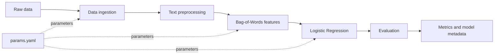

<div align="center">

# Emotion Detection MLOps

**A reproducible NLP pipeline for emotion classification with DVC, scikit-learn, and MLflow.**

[](https://www.python.org/)
[](https://dvc.org/)
[](https://scikit-learn.org/)
[](https://mlflow.org/)
[](LICENSE)

[Repository](https://github.com/Div7anshKushwaha/Emotion-Detection-MLOps) · [DVC pipeline](dvc.yaml) · [Experiment parameters](params.yaml)

</div>

---

## Overview

This project demonstrates how to organize a binary emotion-classification machine learning workflow as a reproducible pipeline rather than as a collection of notebook steps. The ingestion stage uses the `tweet_emotions.csv` source dataset and retains the `happiness` and `sadness` classes, mapping them to labels `1` and `0`. DVC tracks the dependencies, parameters, and generated artifacts for each stage. MLflow records the evaluation run, model parameters, metrics, and model artifact through the configured DagsHub tracking integration.

The repository is intended as an MLOps learning project and a foundation for future improvements such as stronger validation, automated testing, model serving, and deployment. The current pipeline should not be interpreted as a production-ready service.

## What the pipeline does

The workflow is defined in [`dvc.yaml`](dvc.yaml) and contains five stages:



1. **Data ingestion** splits the source dataset into training and test CSV files using a fixed random seed and configurable test size.

1. **Data preprocessing** normalizes the text, removes URLs and mentions, strips hashtag symbols and non-alphabetic characters, normalizes whitespace, and removes empty records.

1. **Feature engineering** fits a scikit-learn `CountVectorizer` on the training text and applies the learned vocabulary to both splits. The resulting Bag-of-Words matrices are saved as CSV files, together with the vectorizer.

1. **Model building** trains a scikit-learn `LogisticRegression` classifier using the parameters in `params.yaml`.

1. **Model evaluation** calculates accuracy, precision, recall, F1 score, and ROC-AUC. It saves the metrics locally and logs the metrics, model parameters, model artifact, and run metadata to MLflow.

## Repository structure

```
Emotion-Detection-MLOps/
├── .dvc/                         # DVC configuration
├── data/                         # Generated raw and processed data (ignored by Git)
├── docs/                         # Sphinx documentation sources
├── models/                       # Generated model and vectorizer artifacts
├── notebooks/                    # Experiments and exploratory work
├── reports/                      # Generated metrics and model metadata
├── src/
│   ├── data/
│   │   ├── data_ingestion.py     # Dataset split and ingestion
│   │   └── data_preprocessing.py # Text cleaning
│   ├── features/
│   │   └── feature_engineering.py # Bag-of-Words feature creation
│   ├── model/
│   │   ├── model_building.py     # Logistic Regression training
│   │   └── model_evaluation.py   # Metrics and MLflow logging
│   └── visualization/            # Reserved for visualizations
├── dvc.yaml                      # Pipeline stages
├── dvc.lock                      # Locked pipeline state
├── params.yaml                   # Reproducible experiment parameters
├── requirements.txt              # Python dependencies
├── setup.py                      # Package metadata
├── test_environment.py           # Python environment check
├── Makefile                      # Utility targets
├── tox.ini                       # Lint configuration
└── README.md
```

Generated data and model artifacts are intentionally excluded from normal Git tracking. They are created when the DVC pipeline runs, or retrieved from a configured DVC remote when one is available.

## Quick start

### Prerequisites

- Python 3.9 or newer

- Git

- A DVC installation

- Network access to retrieve the dataset used by the ingestion stage

### 1. Clone the repository

```bash
git clone https://github.com/Div7anshKushwaha/Emotion-Detection-MLOps.git
cd Emotion-Detection-MLOps
```

### 2. Create and activate a virtual environment

**macOS/Linux**

```bash
python3 -m venv .venv
source .venv/bin/activate
```

**Windows PowerShell**

```
python -m venv .venv
.\.venv\Scripts\Activate.ps1
```

### 3. Install dependencies

```bash
python -m pip install --upgrade pip
python -m pip install -r requirements.txt
python -m pip install dvc
```

Install the repository as an editable package if you want it available on the Python path:

```bash
python -m pip install -e .
```

### 4. Validate the Python environment

```bash
python test_environment.py
```

### 5. Reproduce the pipeline

```bash
dvc repro
```

The pipeline creates the following primary outputs:

- `data/raw/train.csv` and `data/raw/test.csv`

- `data/processed/train_processed.csv` and `data/processed/test_processed.csv`

- `data/features/train_bow.csv` and `data/features/test_bow.csv`

- `models/vectorizer.pkl` and `models/model.pkl`

- `reports/metrics.json` and `reports/model_info.json`

## Inspect the pipeline and metrics

```bash
# Print the dependency graph
dvc dag

# Show whether stages are up to date
dvc status

# Display the metrics file tracked by DVC
dvc metrics show

# Compare metrics between Git revisions
dvc metrics diff
```

You can also inspect the generated files directly:

```bash
cat reports/metrics.json
cat reports/model_info.json
```

## Configure experiments

Pipeline parameters are centralized in [`params.yaml`](params.yaml):

```yaml
data_ingestion:
  test_size: 0.30
  random_state: 42
feature_engineering:
  max_features: 5000
model_building:
  C: 1
  penalty: l2
  solver: liblinear
  max_iter: 1000
```

Edit a parameter, then reproduce the workflow:

```bash
# Example: change the vocabulary size in params.yaml
dvc repro
dvc metrics show
```

DVC uses the parameter values recorded in `dvc.lock` to determine which stages need to be rerun. Commit the parameter change, lock-file update, and any relevant metric comparison together when preserving an experiment.

## MLflow and DagsHub tracking

The evaluation stage initializes DagsHub and configures MLflow for the repository’s DagsHub experiment. During evaluation, the code logs:

- Accuracy, precision, recall, F1 score, and ROC-AUC

- The trained scikit-learn model

- Model parameters returned by `get_params()`

- `reports/metrics.json`

- `reports/model_info.json`

- The evaluation error log

The tracking configuration is implemented in [`src/model/model_evaluation.py`](src/model/model_evaluation.py). To use a different MLflow tracking backend, update that configuration and provide the credentials required by the selected backend. Do not commit credentials or tokens to the repository.

## DVC remote storage

This repository contains DVC metadata, but the local configuration does not define a shared DVC remote. Therefore, `dvc pull` and `dvc push` require a remote to be configured before they can be used.

After choosing an artifact store, configure it with DVC. For example:

```bash
dvc remote add -d storage <remote-url>
dvc push
```

Replace `<remote-url>` with the URL for your approved storage backend. Keep access credentials outside the repository.

## Development commands

The repository includes a Makefile with utility targets. List the available targets with:

```bash
make help
```

The environment check can also be run through Make:

```bash
make test_environment
```

The project includes a minimal environment test. Additional unit, data-validation, and integration tests are recommended before using the pipeline in a production setting.

## Limitations and next steps

The current repository focuses on training and evaluation. It does not yet provide a prediction API, a container image, a CI/CD workflow, a configured shared artifact store, or monitoring for data and model drift. Natural next steps include adding automated tests, validating input data and model artifacts, comparing additional text representations and classifiers, containerizing the workflow, and deploying a versioned inference service.

## Author

**Divyansh Kushwaha**
BS in Data Science and Applications, IIT Madras

- GitHub: [@Div7anshKushwaha](https://github.com/Div7anshKushwaha)

- Repository: [Emotion-Detection-MLOps](https://github.com/Div7anshKushwaha/Emotion-Detection-MLOps)

## License

This project is licensed under the MIT License. See [LICENSE](LICENSE) for details.

## References

[1]: https://dvc.org/doc "DVC Documentation"

[2]: https://mlflow.org/docs/latest/ "MLflow Documentation"

[3]: https://dagshub.com/docs/integration_guide/mlflow_tracking/ "DagsHub MLflow Tracking"

[4]: https://scikit-learn.org/stable/ "scikit-learn Documentation"

[5]: https://docs.python.org/3/ "Python Documentation"