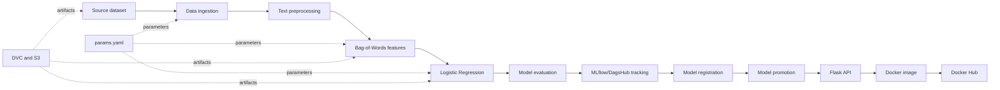

<div align="center">

# Emotion Detection MLOps

**A reproducible and deployable NLP pipeline for binary emotion classification.**

[](https://www.python.org/)
[](https://dvc.org/)
[](https://scikit-learn.org/)
[](https://mlflow.org/)
[](https://github.com/features/actions)
[](https://www.docker.com/)
[](https://flask.palletsprojects.com/)
[](LICENSE)

[Repository](https://github.com/Div7anshKushwaha/Emotion-Detection-MLOps) · [DVC pipeline](dvc.yaml) · [Experiment parameters](params.yaml)

</div>

---

## Overview

This project is a learning-focused MLOps implementation for binary emotion classification. It uses the `tweet_emotions.csv` dataset and retains two classes:

- `happiness` → `1`

- `sadness` → `0`

The project began as a reproducible DVC training pipeline and has been extended with experiment tracking, model registration, model promotion, Flask serving, automated tests, GitHub Actions CI, Docker image creation, and Docker Hub publishing.

The goal is not to claim production readiness. The goal is to understand the engineering practices required to move from a notebook-style experiment toward a repeatable, testable, and deployable ML system.

## Current capabilities

- Reproducible data and model pipeline with DVC

- Configurable experiments through `params.yaml`

- DVC artifact storage using an S3 remote

- Experiment tracking with MLflow and DagsHub

- Logging of model parameters, metrics, artifacts, and run metadata

- Model registration and version management

- Model promotion through the MLflow/DagsHub registry

- Flask web application and JSON prediction API

- Health-check endpoint with model information

- Input validation and application error logging

- Automated model and Flask endpoint tests with pytest

- GitHub Actions CI for pipeline reproduction, testing, and model promotion

- Dockerized Flask inference service using Gunicorn

- Automated Docker image build and push to Docker Hub

## End-to-end workflow


```mermaid
flowchart LR
    A[Source dataset] --> B[Data ingestion]
    B --> C[Text preprocessing]
    C --> D[Bag-of-Words features]
    D --> E[Logistic Regression]
    E --> F[Model evaluation]
    F --> G[MLflow/DagsHub tracking]
    G --> H[Model registration]
    H --> I[Model promotion]
    I --> J[Flask API]
    J --> K[Docker image]
    K --> L[Docker Hub]

    P[params.yaml] -. parameters .-> B
    P -. parameters .-> D
    P -. parameters .-> E
    R[DVC and S3] -. artifacts .-> A
    R -. artifacts .-> D
    R -. artifacts .-> E
```

## DVC pipeline

The workflow is defined in [`dvc.yaml`](dvc.yaml) and contains six stages:

1. **Data ingestion** splits the source dataset into training and test CSV files using a configurable test size and random seed.

1. **Data preprocessing** normalizes text, removes URLs and mentions, removes punctuation and non-alphabetic characters, normalizes whitespace, and removes empty records.

1. **Feature engineering** fits a scikit-learn `CountVectorizer` on the training text and applies the learned vocabulary to both training and test data.

1. **Model building** trains a scikit-learn `LogisticRegression` classifier using the parameters in `params.yaml`.

1. **Model evaluation** calculates accuracy, precision, recall, F1 score, and ROC-AUC. It also logs the model and evaluation information to MLflow.

1. **Model registration** registers the tracked model and stores the metadata required for later promotion and serving.

Run the complete pipeline with:

```bash
dvc repro
```

## Repository structure

```
Emotion-Detection-MLOps/
├── .dvc/
│   ├── .gitignore
│   └── config                     # DVC configuration and S3 remote
├── .github/workflows/
│   └── ci.yaml                    # Test and Docker CI workflow
├── data/                          # Generated raw, processed, and feature data
├── docs/                          # Sphinx documentation sources
├── flask_app/
│   ├── __init__.py
│   ├── app.py                     # Flask API and web application
│   ├── requirements.txt           # Runtime dependencies for serving
│   ├── static/style.css           # Web UI styling
│   └── templates/index.html        # Web UI template
├── models/                        # Generated model and vectorizer artifacts
├── notebooks/                     # Experiments and exploratory work
├── references/                    # Reserved reference material
├── reports/                       # Generated metrics and model metadata
├── src/
│   ├── data/
│   │   ├── data_ingestion.py
│   │   └── data_preprocessing.py
│   ├── features/
│   │   └── feature_engineering.py
│   ├── model/
│   │   ├── model_building.py
│   │   ├── model_evaluation.py
│   │   ├── register_model.py
│   │   └── promote_model.py
│   └── visualization/
├── tests/
│   ├── test_flask.py
│   └── test_model.py
├── Dockerfile                     # Container image definition
├── .dockerignore                  # Docker build exclusions
├── dvc.yaml                       # DVC pipeline definition
├── dvc.lock                       # Locked DVC pipeline state
├── params.yaml                    # Experiment parameters
├── requirements.txt               # Main project dependencies
├── setup.py                       # Package metadata
├── test_environment.py            # Environment validation
├── Makefile                       # Utility commands
├── tox.ini                        # Tox/lint configuration
├── README.md
└── LICENSE
```

Generated datasets, models, and reports are not normally committed to Git. They are created by the DVC pipeline or retrieved from the configured DVC remote.

## Quick start

### Prerequisites

- Python 3.9 or newer

- Git

- Docker, if running the container locally

- AWS credentials with access to the configured DVC S3 remote

- DVC with S3 support

- DagsHub/MLflow credentials for tracking and model registry access

- Network access to retrieve the source dataset and remote artifacts

### 1. Clone the repository

```bash
git clone https://github.com/Div7anshKushwaha/Emotion-Detection-MLOps.git
cd Emotion-Detection-MLOps
```

### 2. Create and activate a virtual environment

**macOS/Linux**

```bash
python3 -m venv .venv
source .venv/bin/activate
```

**Windows PowerShell**

```
python -m venv .venv
.\.venv\Scripts\Activate.ps1
```

### 3. Install dependencies

```bash
python -m pip install --upgrade pip
python -m pip install -r requirements.txt
python -m pip install -e .
```

The serving dependencies in `flask_app/requirements.txt` include Flask, Gunicorn, MLflow, NLTK, pandas, scikit-learn, and joblib.

### 4. Configure credentials

Do not commit credentials, tokens, or access keys to the repository. Configure them through environment variables or your CI secret manager.

For local development, the project may require credentials for:

- DagsHub MLflow tracking and model registry

- AWS S3 DVC storage

The GitHub Actions workflow expects these repository secrets:

```
DAGSHUB_USERNAME
DAGSHUB_PAT
AWS_ACCESS_KEY_ID
AWS_SECRET_ACCESS_KEY
DOCKER_HUB_USERNAME
DOCKER_HUB_ACCESS_TOKEN
```

The workflow currently uses the `ap-southeast-2` AWS region.

### 5. Validate the environment

```bash
python test_environment.py
```

### 6. Reproduce the pipeline

```bash
dvc repro
```

The main outputs include:

```
data/raw/train.csv
data/raw/test.csv
data/processed/train_processed.csv
data/processed/test_processed.csv
data/features/train_bow.csv
data/features/test_bow.csv
models/vectorizer.pkl
models/model.pkl
reports/metrics.json
reports/model_info.json
```

## Inspect the pipeline and metrics

```bash
# Print the dependency graph
dvc dag

# Show whether stages are up to date
dvc status

# Display tracked metrics
dvc metrics show

# Compare metrics between Git revisions
dvc metrics diff
```

Inspect generated metadata directly:

```bash
cat reports/metrics.json
cat reports/model_info.json
```

## Configure experiments

Pipeline parameters are centralized in [`params.yaml`](params.yaml):

```yaml
data_ingestion:
  test_size: 0.30
  random_state: 42
feature_engineering:
  max_features: 5000
model_building:
  C: 1
  penalty: l2
  solver: liblinear
  max_iter: 1000
```

After changing a parameter, reproduce the affected stages:

```bash
dvc repro
dvc metrics show
```

DVC uses the parameter values recorded in `dvc.lock` to determine which stages need to be rerun.

## MLflow and DagsHub

The evaluation stage configures MLflow with the project’s DagsHub tracking backend. It logs:

- Accuracy, precision, recall, F1 score, and ROC-AUC

- The trained scikit-learn model

- Model parameters from `get_params()`

- `reports/metrics.json`

- `reports/model_info.json`

- Source and error information when available

The model-registration stage registers a model version. The promotion script moves the selected model through the configured registry stage for serving.

Run the registry scripts manually when required:

```bash
python src/model/register_model.py
python src/model/promote_model.py
```

Model registry operations require valid DagsHub/MLflow credentials. Keep all credentials outside the source code.

## Flask model serving

The Flask application is located in [`flask_app/app.py`](flask_app/app.py). It loads the configured version of the registered MLflow model and the saved vectorizer, then exposes both browser and JSON interfaces.

Start the application with:

```bash
python flask_app/app.py
```

The service listens on `http://localhost:5000` by default.

### Available endpoints

| Endpoint | Method | Description |
| --- | --- | --- |
| `/` | GET | Renders the prediction page |
| `/health` | GET | Returns service and model health information |
| `/predict` | POST | Returns an emotion prediction from JSON input |
| `/predict-ui` | POST | Handles form submissions from the web interface |

### Health check

```bash
curl http://localhost:5000/health
```

Example response:

```json
{
  "status": "healthy",
  "model": "EmotionDetectionModel",
  "version": 4
}
```

The reported version is configured in the Flask application and should remain synchronized with the model version promoted for serving.

### Prediction request

```bash
curl -X POST http://localhost:5000/predict \
  -H "Content-Type: application/json" \
  -d '{"text":"I am very happy today"}'
```

Example response:

```json
{
  "text": "I am very happy today",
  "emotion": "Happiness"
}
```

A request without a `text` field returns HTTP `400` with a validation error.

## Docker

The project includes a [`Dockerfile`](Dockerfile) for packaging the Flask inference service. The image uses Python 3.12 slim and starts the application with Gunicorn on port `5000`.

Build the image locally:

```bash
docker build -t emotion-detection:v2 .
```

Run the container:

```bash
docker run --rm -p 5000:5000 \\
  -e DAGSHUB_USERNAME="$DAGSHUB_USERNAME" \\
  -e DAGSHUB_PAT="$DAGSHUB_PAT" \\
  emotion-detection:v2
```

Check the running service:

```bash
curl http://localhost:5000/health
```

The application loads the registered MLflow model from DagsHub at runtime and loads the generated vectorizer from `models/vectorizer.pkl`. Ensure the required DVC artifacts are available before building the image.

The image is published to Docker Hub as:

```
div7ansh/emotion-detection:v2
```

## Automated tests

Run all tests with:

```bash
python -m pytest tests/ -v
```

The current tests cover:

- Flask home route

- Flask health endpoint

- Successful prediction requests

- Missing-input validation

- Model behavior and related checks in `tests/`

## Continuous integration

The GitHub Actions workflow is defined in [`.github/workflows/ci.yaml`](.github/workflows/ci.yaml). It runs on pushes and pull requests targeting `master`.

The workflow has two jobs:

### Test job

1. Checks out the repository

1. Sets up Python 3.12

1. Restores pip dependencies using GitHub Actions caching

1. Installs project dependencies

1. Reproduces the DVC pipeline

1. Runs the automated tests

1. Promotes the model through the registry

### Docker job

The Docker job runs after the test job succeeds. It:

1. Checks out the repository

1. Logs in to Docker Hub

1. Builds the Docker image

1. Pushes `div7ansh/emotion-detection:v2` to Docker Hub

The Docker Hub credentials are supplied through GitHub repository secrets. The current workflow is a CI and image-publishing workflow; it does not yet deploy the container to a cloud environment.

## DVC remote storage

The repository is configured with an S3-backed DVC remote. The remote URL is stored in `.dvc/config`; credentials are intentionally not stored in Git.

Inspect the configured remotes:

```bash
dvc remote list
```

Retrieve tracked artifacts:

```bash
dvc pull
```

Upload new tracked artifacts from an approved credentialed environment:

```bash
dvc push
```

## Development commands

List available Makefile commands:

```bash
make help
```

Run the environment check through Make:

```bash
make test_environment
```

## Implemented versus future work

### Implemented

- DVC-based reproducible training pipeline

- S3-backed DVC artifact storage

- MLflow/DagsHub experiment tracking

- Model registration and promotion

- Flask model serving

- Pytest coverage for model and API behavior

- GitHub Actions CI

- Docker image creation

- Docker Hub publishing

### Future work

This is still a learning project and should not be interpreted as production-ready. Future improvements include:

- Continuous deployment after image publishing

- Cloud deployment and infrastructure configuration

- Stronger integration and end-to-end test coverage

- Data-quality validation

- Input-data drift monitoring

- Model-performance monitoring after labelled feedback becomes available

- Alerting and operational dashboards

- Canary or staged deployment

- Automated rollback to the last known-good model

- API authentication, rate limiting, and production security hardening

## Learning outcomes

This project has helped demonstrate how an ML model moves beyond training:

- DVC makes data and pipeline execution reproducible.

- MLflow and DagsHub make experiments and model versions traceable.

- A model registry provides a controlled path from training to serving.

- Flask exposes the model through an application interface.

- Pytest validates application and model behavior.

- GitHub Actions automates repeatable checks.

- Docker packages the inference service into a portable runtime image.

## Author

**Divyansh Kushwaha**
BS in Data Science and Applications, IIT Madras

- GitHub: [@Div7anshKushwaha](https://github.com/Div7anshKushwaha)

- Repository: [Emotion-Detection-MLOps](https://github.com/Div7anshKushwaha/Emotion-Detection-MLOps)

## License

This project is licensed under the MIT License. See [LICENSE](LICENSE) for details.

## References

- [DVC Documentation](https://dvc.org/doc)

- [MLflow Documentation](https://mlflow.org/docs/latest/)

- [DagsHub MLflow Tracking](https://dagshub.com/docs/integration_guide/mlflow_tracking/)

- [scikit-learn Documentation](https://scikit-learn.org/stable/)

- [Flask Documentation](https://flask.palletsprojects.com/)

- [Docker Documentation](https://docs.docker.com/)

- [GitHub Actions Documentation](https://docs.github.com/en/actions)