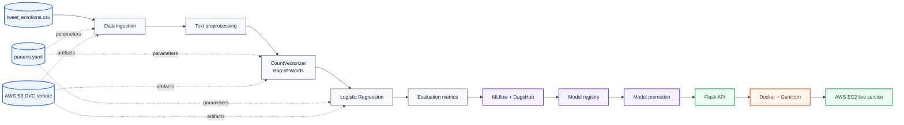
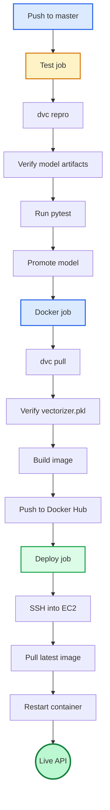

<div align="center">

# Emotion Detection MLOps

### From reproducible training pipeline to a live, containerized ML service.

A learning-focused end-to-end MLOps project for binary emotion classification using DVC, MLflow, DagsHub, Flask, Docker, GitHub Actions, AWS S3, and EC2.

[](http://ec2-3-26-77-200.ap-southeast-2.compute.amazonaws.com:5000/)
[](http://ec2-3-26-77-200.ap-southeast-2.compute.amazonaws.com:5000/health)
[](https://github.com/Div7anshKushwaha/Emotion-Detection-MLOps/actions)
[](https://hub.docker.com/r/div7ansh/emotion-detection)

[](https://www.python.org/)
[](https://dvc.org/)
[](https://mlflow.org/)
[](https://flask.palletsprojects.com/)
[](LICENSE)

[**Open the live application**](http://ec2-3-26-77-200.ap-southeast-2.compute.amazonaws.com:5000/) · [**View the repository**](https://github.com/Div7anshKushwaha/Emotion-Detection-MLOps)

</div>

---

## Project snapshot

| Area | Current implementation |
| --- | --- |
| **Problem** | Binary text emotion classification: happiness vs. sadness |
| **Model** | scikit-learn Logistic Regression |
| **Features** | Bag-of-Words with `CountVectorizer` |
| **Pipeline** | Six-stage DVC workflow |
| **Experiment tracking** | MLflow with DagsHub |
| **Artifact storage** | DVC with AWS S3 |
| **Model lifecycle** | Registration and promotion through the model registry |
| **Serving** | Flask API and browser interface |
| **Testing** | pytest model and Flask tests |
| **CI/CD** | GitHub Actions → Docker Hub → AWS EC2 |
| **Runtime** | Docker + Gunicorn |
| **Live status** | EC2-hosted endpoint configured; availability depends on the instance being running |

> **Project goal:** understand how an ML experiment becomes reproducible, testable, trackable, containerized, and deployable.

## Live demo

### Application

[**Launch Emotion Detection**](http://ec2-3-26-77-200.ap-southeast-2.compute.amazonaws.com:5000/)

The live application provides a simple browser interface for entering text and receiving an emotion prediction.

### Health check

[**Check live service health**](http://ec2-3-26-77-200.ap-southeast-2.compute.amazonaws.com:5000/health)

Expected response when the EC2 instance is running:

```json
{
  "model": "EmotionDetectionModel",
  "status": "healthy",
  "version": 4
}
```

### Live API prediction

```bash
curl -X POST \
  http://ec2-3-26-77-200.ap-southeast-2.compute.amazonaws.com:5000/predict \
  -H "Content-Type: application/json" \
  -d '{"text":"I am very happy today"}'
```

Response:

```json
{
  "emotion": "Happiness",
  "text": "I am very happy today"
}
```

> The demo currently uses HTTP on port `5000` for learning purposes. If the EC2 instance is stopped or restarting, the live URL may be temporarily unavailable. HTTPS, authentication, and production hardening are future improvements.

---

## Architecture


```mermaid
flowchart LR
    classDef source fill:#eff6ff,stroke:#2563eb,color:#172554,stroke-width:2px;
    classDef process fill:#f8fafc,stroke:#64748b,color:#0f172a,stroke-width:1.5px;
    classDef tracking fill:#f5f3ff,stroke:#7c3aed,color:#2e1065,stroke-width:2px;
    classDef serving fill:#ecfdf5,stroke:#16a34a,color:#14532d,stroke-width:2px;
    classDef delivery fill:#fff7ed,stroke:#ea580c,color:#7c2d12,stroke-width:2px;

    A[(tweet_emotions.csv )]:::source --> B[Data ingestion]:::process
    B --> C[Text preprocessing]:::process
    C --> D[CountVectorizer  
Bag-of-Words]:::process
    D --> E[Logistic Regression]:::process
    E --> F[Evaluation metrics]:::process
    F --> G[MLflow + DagsHub]:::tracking
    G --> H[Model registry]:::tracking
    H --> I[Model promotion]:::tracking
    I --> J[Flask API]:::serving
    J --> K[Docker + Gunicorn]:::delivery
    K --> L[AWS EC2 live service]:::serving

    P[(params.yaml)]:::source -. parameters .-> B
    P -. parameters .-> D
    P -. parameters .-> E
    S[(AWS S3 DVC remote)]:::source -. artifacts .-> B
    S -. artifacts .-> D
    S -. artifacts .-> E
```

## CI/CD delivery flow

Every push to `master` follows this path:


```mermaid
flowchart TB
    A[Push to master] --> B[Test job]
    B --> B1[dvc repro]
    B1 --> B2[Verify model artifacts]
    B2 --> B3[Run pytest]
    B3 --> B4[Promote model]
    B4 --> C[Docker job]
    C --> C1[dvc pull]
    C1 --> C2[Verify vectorizer.pkl]
    C2 --> C3[Build image]
    C3 --> C4[Push to Docker Hub]
    C4 --> D[Deploy job]
    D --> D1[SSH into EC2]
    D1 --> D2[Pull latest image]
    D2 --> D3[Restart container]
    D3 --> E((Live API))

    style A fill:#dbeafe,stroke:#2563eb,stroke-width:2px
    style B fill:#fef3c7,stroke:#d97706,stroke-width:2px
    style C fill:#dbeafe,stroke:#2563eb,stroke-width:2px
    style D fill:#dcfce7,stroke:#16a34a,stroke-width:2px
    style E fill:#bbf7d0,stroke:#15803d,stroke-width:3px
```

## What the project demonstrates

### Reproducible ML

- DVC tracks pipeline dependencies, parameters, and outputs.

- `dvc.lock` records the reproducible state of the pipeline.

- `params.yaml` centralizes data-split, feature, and model configuration.

- Generated artifacts are stored through an S3-backed DVC remote.

### Experiment and model management

- MLflow records metrics, parameters, artifacts, and run metadata.

- DagsHub provides the remote MLflow tracking backend.

- Models are registered and promoted through the model registry.

- The Flask service loads the configured registered model version.

### Application engineering

- Flask exposes browser and JSON interfaces.

- `/health` reports service and model information.

- `/predict` accepts JSON input and returns a prediction.

- Invalid requests are validated and logged.

- Gunicorn runs the application inside the Docker container.

### Delivery automation

- GitHub Actions reproduces the pipeline and runs tests.

- The Docker job pulls DVC artifacts before building the image.

- The image is pushed to Docker Hub.

- The deploy job restarts the container on AWS EC2.

---

## DVC pipeline

The workflow is defined in [`dvc.yaml`](dvc.yaml) and contains six stages:

| Stage | Responsibility | Main output |
| --- | --- | --- |
| `data_ingestion` | Split source data into train and test sets | `data/raw/*.csv` |
| `data_preprocessing` | Clean and normalize text | `data/processed/*.csv` |
| `feature_engineering` | Create Bag-of-Words features | `data/features/*.csv` |
| `model_building` | Train Logistic Regression | `models/model.pkl` |
| `model_evaluation` | Calculate metrics and log to MLflow | `reports/metrics.json` |
| `model_registration` | Register model metadata | `reports/model_info.json` |

Run the complete pipeline:

```bash
dvc repro
```

Inspect the workflow:

```bash
dvc dag
dvc status
dvc metrics show
dvc metrics diff
```

## Model details

The current pipeline uses:

- **Dataset:** `tweet_emotions.csv`

- **Classes:** `happiness`, `sadness`

- **Text representation:** Bag-of-Words

- **Feature extractor:** scikit-learn `CountVectorizer`

- **Classifier:** scikit-learn `LogisticRegression`

- **Evaluation:** accuracy, precision, recall, F1 score, and ROC-AUC

Current experiment parameters:

```yaml
data_ingestion:
  test_size: 0.30
  random_state: 42
feature_engineering:
  max_features: 5000
model_building:
  C: 1
  penalty: l2
  solver: liblinear
  max_iter: 1000
```

Change a parameter and reproduce the affected stages:

```bash
# Example: change max_features in params.yaml
dvc repro
dvc metrics show
```

---

## Flask API

The application is implemented in [`flask_app/app.py`](flask_app/app.py).

| Endpoint | Method | Purpose |
| --- | --- | --- |
| `/` | `GET` | Browser prediction interface |
| `/health` | `GET` | Service and model health check |
| `/predict` | `POST` | JSON prediction endpoint |
| `/predict-ui` | `POST` | Browser form submission endpoint |

### JSON prediction request

```bash
curl -X POST http://localhost:5000/predict \
  -H "Content-Type: application/json" \
  -d '{"text":"I am very happy today"}'
```

Example response:

```json
{
  "text": "I am very happy today",
  "emotion": "Happiness"
}
```

Missing input returns HTTP `400`:

```json
{
  "error": "Text is required"
}
```

### Run locally

```bash
python flask_app/app.py
```

The local service listens on:

```
http://localhost:5000
```

---

## Docker

The [`Dockerfile`](Dockerfile) packages the Flask inference service using Python 3.12 slim and Gunicorn.

### Build locally

Make sure the DVC-generated vectorizer is available first:

```bash
dvc pull

docker build -t emotion-detection:v2 .
```

### Run locally

```bash
docker run --rm -p 5000:5000 \
  -e DAGSHUB_USERNAME="$DAGSHUB_USERNAME" \
  -e DAGSHUB_PAT="$DAGSHUB_PAT" \
  emotion-detection:v2
```

Verify the container:

```bash
curl http://localhost:5000/health
```

Published image:

```
div7ansh/emotion-detection:v2
```

[View the Docker Hub image](https://hub.docker.com/r/div7ansh/emotion-detection)

---

## Testing

Run the full test suite:

```bash
python -m pytest tests/ -v
```

Current tests cover:

- Flask home route

- Flask health endpoint

- Successful prediction requests

- Missing-input validation

- Model behavior and related checks

Validate the Python environment:

```bash
python test_environment.py
```

---

## Continuous integration and deployment

The workflow is defined in [`.github/workflows/ci.yaml`](.github/workflows/ci.yaml).

### Test job

Runs on pushes and pull requests targeting `master`:

1. Set up Python 3.12

1. Restore pip dependencies from cache

1. Install dependencies

1. Run `dvc repro`

1. Verify `models/vectorizer.pkl`

1. Run pytest

1. Promote the model

### Docker job

Runs after the test job on successful pushes:

1. Install project dependencies

1. Run `dvc pull`

1. Verify model artifacts

1. Build the Docker image

1. Push `div7ansh/emotion-detection:v2` to Docker Hub

### Deploy job

Runs after the Docker job:

1. Connect to EC2 using SSH

1. Pull the latest Docker image

1. Stop and remove the previous container

1. Start the updated container on port `5000`

1. Serve the live Flask application

Required GitHub repository secrets:

```
DAGSHUB_USERNAME
DAGSHUB_PAT
AWS_ACCESS_KEY_ID
AWS_SECRET_ACCESS_KEY
DOCKER_HUB_USERNAME
DOCKER_HUB_ACCESS_TOKEN
EC2_HOST
EC2_USERNAME
EC2_SSH_KEY
```

---

## Project structure

```
Emotion-Detection-MLOps/
├── .dvc/                         # DVC configuration and S3 remote
├── .github/workflows/
│   └── ci.yaml                  # Test → Docker → EC2 deployment
├── data/                         # Generated raw, processed, and feature data
├── docs/                         # Sphinx documentation
├── flask_app/
│   ├── __init__.py
│   ├── app.py                   # Flask API and web application
│   ├── requirements.txt         # Serving dependencies
│   ├── static/style.css         # UI styles
│   └── templates/index.html      # Prediction interface
├── models/                       # DVC-generated model artifacts
├── notebooks/                    # Experiments
├── reports/                      # Metrics and model metadata
├── src/
│   ├── data/
│   │   ├── data_ingestion.py
│   │   └── data_preprocessing.py
│   ├── features/
│   │   └── feature_engineering.py
│   ├── model/
│   │   ├── model_building.py
│   │   ├── model_evaluation.py
│   │   ├── register_model.py
│   │   └── promote_model.py
│   └── visualization/
├── tests/
│   ├── test_flask.py
│   └── test_model.py
├── Dockerfile                   # Container image definition
├── .dockerignore                # Docker build exclusions
├── dvc.yaml                     # DVC pipeline definition
├── dvc.lock                     # Locked pipeline state
├── params.yaml                  # Experiment parameters
├── requirements.txt             # Project dependencies
├── setup.py                     # Package metadata
├── Makefile                     # Development commands
├── test_environment.py          # Environment check
├── tox.ini                      # Tox configuration
├── README.md
└── LICENSE
```

---

## Quick start

### Requirements

- Python 3.9+

- Git

- DVC with S3 support

- Docker for local container execution

- AWS credentials for the DVC remote

- DagsHub/MLflow credentials for tracking and registry operations

### Setup

```bash
git clone https://github.com/Div7anshKushwaha/Emotion-Detection-MLOps.git
cd Emotion-Detection-MLOps

python3 -m venv .venv
source .venv/bin/activate

python -m pip install --upgrade pip
python -m pip install -r requirements.txt
python -m pip install -e .

python test_environment.py
dvc repro
python -m pytest tests/ -v
```

### DVC storage commands

```bash
dvc remote list
dvc pull
dvc push
```

Never commit AWS keys, DagsHub tokens, SSH private keys, or Docker Hub access tokens.

---

## Implemented vs. next milestones

### Implemented

- DVC-based reproducible ML pipeline

- Parameterized experiments

- S3-backed artifact storage

- MLflow/DagsHub experiment tracking

- Model registration and promotion

- Flask model serving

- Automated tests

- GitHub Actions CI

- Docker image creation

- Docker Hub publishing

- AWS EC2 deployment

- Live prediction API

### Next milestones

- HTTPS and a custom domain

- API authentication and rate limiting

- Stronger integration and end-to-end testing

- Data-quality validation

- Input-data drift monitoring

- Model-performance monitoring

- Alerting and operational dashboards

- Canary or blue-green deployment

- Automated rollback to the last known-good model

- Infrastructure as code

---

## Learning outcomes

This project has helped me understand the path from a notebook experiment to a live ML service:

```
Train a model
   ↓
Make the pipeline reproducible
   ↓
Track experiments and artifacts
   ↓
Register and promote models
   ↓
Expose predictions through an API
   ↓
Test the application
   ↓
Containerize the service
   ↓
Automate delivery
   ↓
Deploy to the cloud
```

> The model is only one part of the system. Reproducibility, testing, observability, deployment, and maintainability are equally important.

## Author

**Divyansh Kushwaha**
BS in Data Science and Applications, IIT Madras

- GitHub: [@Div7anshKushwaha](https://github.com/Div7anshKushwaha)

- Repository: [Emotion-Detection-MLOps](https://github.com/Div7anshKushwaha/Emotion-Detection-MLOps)

- Live demo: [Emotion Detection API](http://ec2-3-26-77-200.ap-southeast-2.compute.amazonaws.com:5000/)

## License

This project is licensed under the MIT License. See [LICENSE](LICENSE) for details.

## References

- [DVC Documentation](https://dvc.org/doc)

- [MLflow Documentation](https://mlflow.org/docs/latest/)

- [DagsHub MLflow Tracking](https://dagshub.com/docs/integration_guide/mlflow_tracking/)

- [scikit-learn Documentation](https://scikit-learn.org/stable/)

- [Flask Documentation](https://flask.palletsprojects.com/)

- [Docker Documentation](https://docs.docker.com/)

- [GitHub Actions Documentation](https://docs.github.com/en/actions)